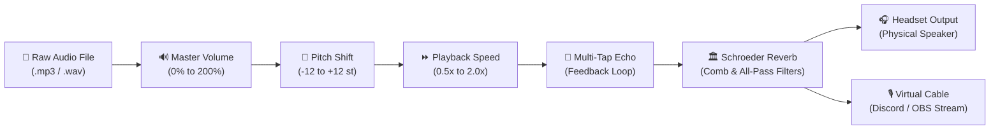

# Virtual Soundboard Pro 2.2

A high-performance virtual soundboard application featuring real-time DSP audio processing, Discord voice channel streaming, dual audio routing (Headset + VB-Audio Virtual Cable), Google Cloud Run deployment with Firebase Authentication, and a standalone Desktop Global Hotkey Companion.

---

## 🏗️ System Architecture & Interactive Design

```mermaid
flowchart TB
    subgraph ClientLayer ["Client & Control Layer"]
        User["👤 User / Gamer"]
        Desktop["🖥️ Desktop Launcher GUI\n(Tkinter Dark Neon)"]
        HotkeyHook["⌨️ Global Hotkey Relay\n(Windows OS Hook)"]
        Browser["🌐 Web App (HTML5 / JS)\n(Physical 3-Column Numpad)"]
    end

    subgraph HostingLayer ["Cloud & Local Runtime"]
        CloudRun["☁️ Google Cloud Run\n(Flask + Gunicorn)\n[ADT / SPT / PRD]"]
        LocalServer["🏠 Local Flask Server\n(http://127.0.0.1:5001)"]
    end

    subgraph SecurityLayer ["Authentication & RBAC"]
        FirebaseAuth["🔐 Firebase Auth\n(Google Sign-In)"]
        Allowlist["📋 ALLOWED_USERS\n(Email Allowlist)"]
        CompanionAuth["🔑 X-Companion-Key\n(Background Desktop Auth)"]
    end

    subgraph AudioEngineLayer ["Real-Time DSP Engine"]
        DSP["🎛️ DSP Processing Pipeline\n(Pitch · Speed · Echo · Reverb)"]
        WebAudio["🎧 In-Browser Web Audio API\n(Polyphonic Overlapping)"]
        DiscordBot["🤖 Discord Voice Bot\n(FFmpeg + Opus Stream)"]
        AudioHardware["🔊 Physical Hardware\n(WASAPI Headset + VB-Cable)"]
    end

    %% User interactions
    User -->|In-Game Hotkeys| HotkeyHook
    User -->|Browser Clicks| Browser
    User -->|Launch GUI| Desktop

    %% Routing
    Desktop -->|Launches| Browser
    Desktop -->|Starts Relay| HotkeyHook
    HotkeyHook -->|Async REST (X-Companion-Key)| CloudRun
    Browser -->|Google OAuth Bearer Token| FirebaseAuth
    FirebaseAuth --> Allowlist --> CloudRun
    CompanionAuth --> CloudRun

    %% Server to DSP
    CloudRun -->|SSE Events /api/events| Browser
    Browser -->|Headset Toggle ON| WebAudio
    CloudRun -->|Stream Opus Audio| DiscordBot
    LocalServer -->|Direct PCM Stream| DSP --> AudioHardware
```

---

## 🎛️ Real-Time DSP Audio Processing Pipeline



---

## ⌨️ Physical 3-Column Numpad Layout

The soundboard is mapped across a standard physical numpad with 3-tier modifiers for quick muscle-memory access during gameplay:

| Key | `Ctrl` Tier (Group 1) | `Alt` Tier (Group 2) | `Ctrl + Alt` Tier (Group 3) |
|:---:|:---|:---|:---|
| **`7`** | **All Day** | **Heh Heh** | **Revenge** |
| **`8`** | **Always Watching** | **Hell No** | **Sad Trombone** |
| **`9`** | **Applause** | **Holy Shit** | **Sheeesh** |
| **`4`** | **Ba Dum Tss** | **I Did It** | **Silence** |
| **`5`** | **Boo** | **Look At This** | **Surprise** |
| **`6`** | **Bruh** | **Mamma Mia** | **Uh Oh** |
| **`1`** | **Cheering** | **Mission Failed** | **Victory** |
| **`2`** | **Coffin Dance** | **No God No** | **What** |
| **`3`** | **Crickets** | **Oh No** | **Windows Error** |
| **`0`** | **Drama** | **OMG** | **Windows XP** |
| **`.`** | **Emotional Damage** | **Oof** | **Wow** |
| **`Esc`** | <span style="color:#ef4444;font-weight:bold;">🚨 PANIC STOP ALL</span> | <span style="color:#ef4444;font-weight:bold;">🚨 PANIC STOP ALL</span> | <span style="color:#ef4444;font-weight:bold;">🚨 PANIC STOP ALL</span> |

---

## ✨ Features & Highlights

* **Dual-Mode Operation**:
  * **☁️ Cloud Run Mode**: Connect to remote hosted environments (**ADT**, **SPT**, **PRD**) with Google OAuth sign-in and Discord voice bot streaming.
  * **🏠 Local Server Mode**: Run completely offline on `http://127.0.0.1:5001` with direct WASAPI hardware audio routing.
* **In-Game Global Hotkeys**: Desktop companion listens for global Windows hotkeys and triggers Cloud Run audio instantly without tabbing out of fullscreen games.
* **In-Browser Headphone Audio**: 
  * Toggle **🎧 Headset** in the web browser to hear sounds locally with full polyphonic overlapping and speed scaling.
  * Starts **Offline by default** to avoid duplicate audio echo when connected to Discord voice.
* **5-Knob Real-Time DSP Cluster**:
  * **Master Volume** (Gold · 90% default)
  * **Global Pitch Shift** (Cyan · -12 to +12 semitones)
  * **Global Playback Speed** (Pink · 0.5x to 2.0x)
  * **Multi-Tap Echo** (Amber · 0% to 100%)
  * **Algorithmic Room Reverb** (Purple · 0% to 100%)
* **Server-Sent Events (SSE)**: Connected browser instances instantly animate active sound cards and play local audio in real time when remote hotkeys are pressed.
* **1-Click Panic Stop**: Press `Esc` or click the Panic button to immediately terminate all active audio playback across hardware, Discord, and connected browsers.

---

## 🚀 Running the Application

### Option 1: Standalone Desktop Launcher (Recommended)
Double-click `dist\VirtualSoundboard2.exe` (or run `scripts\launch-v2.bat`).

To create a Desktop shortcut on Windows:
```powershell
powershell -ExecutionPolicy Bypass -File scripts\create-desktop-shortcut.ps1
```

### Option 2: Python Development Mode
```powershell
# 1. Create and activate virtual environment
python -m venv venv
.\venv\Scripts\Activate

# 2. Install dependencies
pip install -r requirements.txt

# 3. Start Desktop Launcher GUI
python launcher.py

# Or start Flask server directly
python app.py
```

---

## 🔨 Building the Standalone Executable (`.exe`)

You can compile the standalone Windows executable using the 1-click batch script:
```powershell
.\build-executable.bat
```
*Or via command line:*
```powershell
python -m PyInstaller VirtualSoundboard2.spec --clean --noconfirm
```
The resulting executable is generated at:
👉 **`dist\VirtualSoundboard2.exe`**

---

## 📁 Repository Structure

```text
soundboard_app/
├── app.py                      # Flask web application & Cloud Run entrypoint
├── launcher.py                 # Desktop Tkinter GUI & Global Hotkey Relay
├── build-executable.bat        # 1-Click PyInstaller compiler
├── Dockerfile                  # Production container definition
├── requirements.txt            # Python dependencies
├── soundboard_config.json      # Audio clip metadata & sound mappings
├── VirtualSoundboard2.spec     # PyInstaller bundling spec
├── README.md                   # Project documentation (this file)
├── AGENTS.md                   # AI / Agent developer guide & architecture reference
├── src/                        # Backend Python modules (DSP, auth, discord, config)
├── tests/                      # Automated unit & E2E test suites (16 test suites)
├── docs/                       # Deployment and Discord setup documentation
├── scripts/                    # Deployment & launch utility scripts
├── assets/                     # Application icons and branding
├── static/                     # Web assets (audio files, CSS, JavaScript, favicons)
└── templates/                  # Jinja2 HTML templates
```

---

## 🧪 Testing

Run the automated test suite:
```powershell
python -m unittest discover -s tests
```
*All 16 unit and E2E test suites validate volume, DSP effects, authentication, companion relay, and panic stop.*
