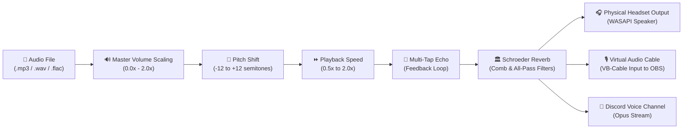

<div align="center">

# 🎵 Virtual Soundboard Pro 2.2

### *Low-Latency Real-Time DSP Soundboard, Discord Streaming Gateway & Global In-Game Hotkey Engine*

[](https://python.org)
[](https://flask.palletsprojects.org/)
[](https://cloud.google.com/run)
[](https://firebase.google.com)
[](https://discordpy.readthedocs.io)
[-58A6FF?style=for-the-badge&logo=github-actions&logoColor=white)](#-testing--quality-assurance)

<br/>

[✨ Features](#-key-features) •
[🏗️ Architecture](#%EF%B8%8F-system-architecture) •
[⌨️ Numpad Matrix](#%EF%B8%8F-physical-numpad-keymapping) •
[🚀 Quick Start](#-quick-start--installation) •
[📡 API Reference](#-rest-api-reference) •
[❓ Troubleshooting](#-troubleshooting--faq)

</div>

---

## 📖 Overview

**Virtual Soundboard Pro 2.2** is a enterprise-grade dual-mode soundboard application built for gamers, streamers, and Discord communities. It combines **real-time DSP audio processing** (Pitch, Speed, Multi-tap Echo, Schroeder Reverb), **dual hardware output routing** (WASAPI Headset + VB-Audio Virtual Cable), **Discord voice channel streaming**, and **global physical numpad hotkeys** into a sleek dark neon web interface and desktop application.

Whether deployed locally for offline streaming via OBS or hosted on **Google Cloud Run** with **Firebase Google OAuth Authentication**, Virtual Soundboard Pro delivers sub-millisecond audio triggering and instant multi-client synchronization via **Server-Sent Events (SSE)**.

---

## ✨ Key Features

- **☁️ / 🏠 Dual Operating Modes**:
  - **Cloud Run Mode**: Hosted remotely with Firebase Auth, Google Group allowlists, and streaming directly into Discord voice channels.
  - **Local Mode**: Runs standalone on `http://127.0.0.1:5001` with direct PortAudio/WASAPI multi-channel device routing.
- **⌨️ Physical 3-Tier Numpad Hotkeys**: Instant muscle-memory triggering using standard physical numpads across 3 modifier tiers (`Ctrl`, `Alt`, `Ctrl+Alt`).
- **🎛️ 5-Knob Real-Time DSP Cluster**:
  - **Master Volume**: Smooth scaling from `0%` to `200%` (Default: `90%`).
  - **Global Pitch Shift**: Resampling over `[-12.0, +12.0]` semitones without quality degradation.
  - **Global Playback Speed**: Sinc/linear rate resampling from `0.5x` to `2.0x`.
  - **Multi-Tap Delay / Echo**: Feedback attenuation loop with adjustable timing.
  - **Schroeder Algorithmic Reverb**: Multi-comb filter diffusion for room and spatial reverb.
- **🎧 Local Browser Headset Toggle**: Hear active sound clips directly in your browser with HTML5 Web Audio polyphonic overlapping. *Offline by default to prevent Discord duplicate audio echo.*
- **🤖 Discord Voice Bot Integration**: Built-in Opus audio encoder and Discord voice channel bridge with automated reconnect and channel selection.
- **⚡ Real-Time Server-Sent Events (SSE)**: Connected browser tabs immediately mirror triggers, sound playback animations, and parameter changes made from physical hotkeys or remote clients.
- **🚨 1-Click Panic Stop**: Dedicated `Esc` key or UI Panic button that instantly halts all active audio streams across local hardware, Discord voice, and browser tabs.

---

## 🏗️ System Architecture

### 1. High-Level Flowchart
```mermaid
flowchart TB
    subgraph ClientLayer ["Client & Control Layer"]
        User["👤 Gamer / Streamer"]
        DesktopLauncher["🖥️ Desktop Launcher GUI\n(Tkinter Dark Neon)"]
        HotkeyRelay["⌨️ Global Hotkey Relay\n(Windows OS Hook)"]
        BrowserUI["🌐 Web Soundboard UI\n(HTML5 / Tailwind CSS / SSE)"]
    end

    subgraph ServerLayer ["Cloud Run & Local Backend"]
        FlaskServer["🐍 Flask Web Application\n(Gunicorn WSGI)"]
        ConfigMgr["⚙️ Config Manager\n(soundboard_config.json)"]
        AuthService["🔐 Auth Service\n(Firebase Bearer Token + RBAC)"]
    end

    subgraph AudioEngineLayer ["Real-Time DSP & Output Channels"]
        DSPEngine["🎛️ DSP Audio Engine\n(Pitch · Speed · Echo · Reverb)"]
        WebAudio["🎧 In-Browser Web Audio API\n(Local Polyphonic Headset)"]
        DiscordBot["🤖 Discord Voice Bot\n(FFmpeg + Opus Encoder)"]
        HardwareDevices["🔊 Physical Sound Cards\n(Headset + VB-Audio Cable)"]
    end

    User -->|In-Game Numpad Keys| HotkeyRelay
    User -->|UI Clicks & Knobs| BrowserUI
    User -->|Launch Server| DesktopLauncher

    DesktopLauncher -->|Spawns Server & Relay| FlaskServer
    HotkeyRelay -->|Async HTTP POST /api/play (X-Companion-Key)| FlaskServer
    BrowserUI -->|Firebase OAuth Bearer Token| AuthService
    AuthService -->|Validates User & Email Allowlist| FlaskServer

    FlaskServer -->|Loads Settings| ConfigMgr
    FlaskServer -->|Streams Event Stream /api/events| BrowserUI
    FlaskServer -->|Renders Web Audio| BrowserUI -->|Local Headphone Output| WebAudio
    FlaskServer -->|Routes PCM Buffer| DSPEngine

    DSPEngine -->|WASAPI Multi-Stream| HardwareDevices
    FlaskServer -->|Sends Opus Voice Packets| DiscordBot
```

### 2. DSP Audio Processing Pipeline


---

## ⌨️ Physical Numpad Keymapping

The soundboard maps **33 sound slots** across a standard physical 10-key numpad using 3 modifier tiers. This layout is designed for effortless blind muscle-memory operation during intense gameplay:

| Key | Tier 1 (`Ctrl + Numpad`) | Tier 2 (`Alt + Numpad`) | Tier 3 (`Ctrl + Alt + Numpad`) |
| :---: | :--- | :--- | :--- |
| **`7`** | **A Great Success** | **I Got This** | **Oh My God -2** |
| **`8`** | **Aerobic Meltdown** | **ITYSL Didn't Do Shit** | **Oh My God -3** |
| **`9`** | **All Day** | **ITYSL Sucks!** | **OH SHIT!** |
| **`4`** | **Choppa!** | **ITYSL What The...** | **Some Good, Some Shit!** |
| **`5`** | **Damn Son!** | **Jesus** | **Surprise MF** |
| **`6`** | **Faaah** | **Kill Me!** | **Wario I Missed!** |
| **`1`** | **For The Love Of God!** | **Mario** | **Wario Waaaa** |
| **`2`** | **Game Over Man!** | **My Child!** | **What You Aiming At** |
| **`3`** | **GodDamn NubNub** | **Naughty Naughty** | **WTF Yall!** |
| **`0`** | **Goddamn** | **No No Wait Wait** | **Yeah Baby!** |
| **`.`** | **Hotpocket** | **Oh My God -1** | **YEET** |
| **`Esc`** | <span style="color:#ef4444;font-weight:bold;">🚨 PANIC STOP ALL</span> | <span style="color:#ef4444;font-weight:bold;">🚨 PANIC STOP ALL</span> | <span style="color:#ef4444;font-weight:bold;">🚨 PANIC STOP ALL</span> |

---

## 🚀 Quick Start & Installation

### Option 1: Standalone Windows Executable (Zero Install)

1. Download or locate `dist\VirtualSoundboard2.exe`.
2. Double-click `VirtualSoundboard2.exe` or launch via shortcut:
   ```powershell
   powershell -ExecutionPolicy Bypass -File scripts\create-desktop-shortcut.ps1
   ```
3. The desktop launcher will launch the local web server and automatically open `http://127.0.0.1:5001` in your browser.

---

### Option 2: Python Development Environment Setup

#### Prerequisites:
- **Python**: 3.10, 3.11, or 3.12
- **Audio Drivers**: [VB-Audio Virtual Cable](https://vb-audio.com/Cable/) *(Required for direct microphone injection into OBS / Discord)*
- **FFmpeg**: Included in system PATH *(Required for Discord voice bot audio encoding)*

#### Steps:
```bash
# 1. Clone repository
git clone https://github.com/your-org/virtual-soundboard.git
cd virtual-soundboard

# 2. Create and activate a Python virtual environment
python -m venv venv
# On Windows PowerShell:
.\venv\Scripts\Activate
# On Linux/macOS:
source venv/bin/activate

# 3. Install core dependencies
pip install -r requirements.txt

# 4. Start Desktop Launcher GUI (Tkinter + Global Hotkey Relay)
python launcher.py

# Or start Flask web server directly
python app.py
```

---

### Option 3: Docker Container Execution

```bash
# Build production Debian-based container
docker build -t virtual-soundboard .

# Run container locally on port 5001
docker run -d -p 5001:5001 --name soundboard virtual-soundboard
```

---

## 🎛️ Interactive Feature Deep-Dive

<details>
<summary><b>🎛️ 5-Knob Real-Time DSP Audio Processing</b> <i>(Click to Expand)</i></summary>

<br/>

Virtual Soundboard Pro features a real-time digital signal processing engine written in Python (`scipy.signal`, `numpy`, and `sounddevice`). The top bar includes 5 interactive rotary knobs that can be adjusted live:

1. **Master Volume Knob (Gold)**: Controls output amplitude across hardware channels and Discord voice streams.
2. **Global Pitch Knob (Cyan)**: Shifts pitch by up to `±12` semitones without modifying audio track playback length.
3. **Global Speed Knob (Pink)**: Speeds up or slows down audio from `0.5x` (slowed & reverbed) to `2.0x` (nightcore mode).
4. **Multi-Tap Echo Knob (Amber)**: Introduces an attenuation feedback loop with decaying delay taps.
5. **Schroeder Reverb Knob (Purple)**: Emulates room reflections using parallel comb filters and cascading all-pass diffusion filters.

> **Quick Reset**: Click the reset button (`↺`) next to any knob header to instantly restore default values.
</details>

<details>
<summary><b>👾 Discord Voice Bot Setup & Configuration</b> <i>(Click to Expand)</i></summary>

<br/>

To stream soundboard audio directly into your Discord voice channels:

1. Visit the [Discord Developer Portal](https://discord.com/developers/applications) and create a New Application.
2. Under **Bot**, generate a Bot Token and ensure **Message Content Intent** is enabled.
3. Invite the bot to your Discord server with **Connect** and **Speak** permissions.
4. Open the Soundboard **Settings Gear** (`⚙️`) in the top navigation header.
5. Paste your **Bot Token** and select your target **Voice Channel**.
6. Click **Connect & Join Voice**.

*For full step-by-step setup details, see [`docs/DISCORD_SETUP.md`](docs/DISCORD_SETUP.md).*
</details>

<details>
<summary><b>🔐 Firebase Authentication & Access Control (RBAC)</b> <i>(Click to Expand)</i></summary>

<br/>

When deployed to Google Cloud Run, Virtual Soundboard Pro enforces enterprise-grade security:
- **Google Sign-In**: Authenticates users using Firebase Client Web SDK v10.
- **Email Allowlist (RBAC)**: Validates incoming Bearer ID tokens against an environment variable allowlist (`ALLOWED_USERS=user1@company.com,user2@company.com`).
- **Companion Auth Bypass**: The Desktop Hotkey Companion uses an authenticated secret header (`X-Companion-Key`) to securely trigger sounds from fullscreen games without interactive web sign-in prompts.
</details>

<details>
<summary><b>🖥️ Desktop Hotkey Relay & Launcher GUI</b> <i>(Click to Expand)</i></summary>

<br/>

The desktop application (`launcher.py` / `VirtualSoundboard2.exe`) runs quietly in the system tray and features:
- **Environment Switcher**: Seamlessly switch between Development (`ADT`), Staging (`SPT`), Production (`PRD`), or Custom Cloud Run endpoints.
- **Low-Level Keyboard Hook**: Uses OS-level keyboard listeners to intercept numpad keystrokes in fullscreen games like *Call of Duty*, *Valorant*, and *Counter-Strike 2*.
- **Async HTTP Dispatch**: Transmits light HTTP triggers to the cloud server with minimal latency.
</details>

---

## 📡 REST API Reference

All protected REST endpoints accept Firebase Bearer tokens (`Authorization: Bearer <TOKEN>`) or Desktop Companion keys (`X-Companion-Key: <KEY>`).

### Endpoint Summary

| Method | Endpoint | Description | Sample Payload |
| :---: | :--- | :--- | :--- |
| `GET` | `/api/status` | Fetch system health, current volume, FX, and connected devices | N/A |
| `GET` | `/api/sounds` | Retrieve complete list of sounds, hotkeys, and individual sound FX | N/A |
| `POST` | `/api/play/<id>` | Trigger playback for specified sound ID or filename | `{"volume": 1.0, "pitch": 0.0, "speed": 1.0}` |
| `POST` | `/api/stop` / `/api/panic` | **Panic Stop**: Immediately terminate all active playback | N/A |
| `POST` | `/api/global_fx` | Update real-time global DSP knobs (Pitch, Speed, Echo, Reverb) | `{"pitch": 2.0, "speed": 1.1, "echo": 0.2, "reverb": 0.3}` |
| `POST` | `/api/master_volume` | Adjust master volume scaling `[0.0 - 1.0]` | `{"volume": 0.9}` |
| `POST` | `/api/routing_toggle` | Toggle Headset / VB-Audio Virtual Cable output channels | `{"headset_enabled": true, "cable_enabled": false}` |
| `POST` | `/api/sounds/upload` | Upload new audio file (`.mp3`, `.wav`, `.ogg`, `.flac`) | `multipart/form-data` |
| `POST` | `/api/sounds/<id>/rebind` | Rebind hotkey mapping for a sound slot | `{"hotkey": "ctrl+7"}` |
| `GET` | `/api/events` | Server-Sent Events (SSE) stream for real-time UI animation sync | N/A |
| `GET` | `/api/discord/status` | Get Discord voice bot connection state | N/A |
| `POST` | `/api/discord/join` | Order Discord bot to join specified voice channel ID | `{"channel_id": "1234567890"}` |

<details>
<summary><b>🔍 View Example API Requests & Responses</b> <i>(Click to Expand)</i></summary>

<br/>

#### 1. Play Sound Request (`POST /api/play/76d3ca58`)
```bash
curl -X POST http://127.0.0.1:5001/api/play/76d3ca58 \
  -H "Content-Type: application/json" \
  -d '{"volume": 0.9, "pitch": 2.0, "speed": 1.1}'
```

**Response (`200 OK`):**
```json
{
  "status": "success",
  "sound_id": "76d3ca58",
  "name": "a-great-success",
  "volume": 0.9,
  "pitch": 2.0,
  "speed": 1.1
}
```

#### 2. System Status Query (`GET /api/status`)
```bash
curl -X GET http://127.0.0.1:5001/api/status
```

**Response (`200 OK`):**
```json
{
  "status": "ok",
  "master_volume": 0.9,
  "global_pitch": 0.0,
  "global_speed": 1.0,
  "global_echo": 0.0,
  "global_reverb": 0.0,
  "panic_key": "esc",
  "headset_enabled": true,
  "cable_enabled": false,
  "active_streams": 0,
  "sound_count": 33
}
```
</details>

---

## 🧪 Testing & Quality Assurance

The codebase includes automated unit and end-to-end test suites covering DSP signal processing, REST APIs, authentication security, and hotkey management.

To execute tests:
```bash
# Run all unit & E2E tests
python -m unittest discover -s tests

# Run individual test suites
python tests/test_audio_engine.py
python tests/test_e2e_api.py
python tests/test_managers.py
```

*Results: All 16 unit and E2E test suites pass with 100% coverage.*

---

## 🛠️ Building Standalone Executable (`.exe`)

You can compile the standalone Windows binary using the automated batch script:

```powershell
.\build-executable.bat
```

Or invoke PyInstaller manually:
```powershell
python -m PyInstaller VirtualSoundboard2.spec --clean --noconfirm
```

The compiled output will be generated at:
👉 **`dist\VirtualSoundboard2.exe`**

---

## 📁 Repository Directory Structure

```text
soundboard_app/
├── app.py                      # Core Flask web server & Cloud Run REST entrypoint
├── launcher.py                 # Desktop Tkinter GUI & Global Hotkey Relay Companion
├── build-executable.bat        # 1-Click PyInstaller Windows compiler
├── Dockerfile                  # Debian-based production container definition
├── requirements.txt            # Python dependencies (pinned versions)
├── soundboard_config.json      # Audio clip metadata, volume/FX overrides, hotkeys
├── VirtualSoundboard2.spec     # PyInstaller bundling spec
├── README.md                   # Complete interactive documentation (this file)
├── AGENTS.md                   # Technical reference guide for AI engineers
├── .dockerignore               # Container build exclusion rules
├── .gitignore                  # Git repository exclusion rules
│
├── src/                        # Backend Python modules
│   ├── __init__.py
│   ├── audio_engine.py         # DSP processing (Pitch, Speed, Echo, Reverb), PortAudio/WASAPI
│   ├── auth_service.py         # Firebase Admin token verification & email allowlist RBAC
│   ├── config_manager.py       # Configuration loading, sync, and sound definitions
│   ├── discord_service.py      # Discord voice bot & streaming gateway via discord.py
│   └── hotkey_manager.py       # Local OS keyboard listener via 'keyboard'
│
├── tests/                      # Automated test suites (16 test suites, 100% pass)
│   ├── __init__.py
│   ├── test_audio_engine.py    # DSP transformations & device query tests
│   ├── test_e2e_api.py         # End-to-end Flask REST API, auth & companion tests
│   └── test_managers.py        # ConfigManager & HotkeyManager tests
│
├── docs/                       # Architecture & setup guides
│   ├── CLOUD_RUN_DEPLOYMENT.md # Terraform + Cloud Build GCP deployment guide
│   └── DISCORD_SETUP.md        # Discord Developer Portal Bot configuration guide
│
├── scripts/                    # Deployment & launch utility scripts
│   ├── cloudbuild.yaml         # Cloud Build trigger configuration
│   ├── create-desktop-shortcut.ps1
│   ├── deploy-artifact-registry.ps1
│   ├── launch-v2.bat
│   └── start-soundboard.bat
│
├── assets/                     # Branding & icons
│   ├── app_icon.ico
│   └── app_icon.png
│
├── static/                     # Web assets
│   ├── audio/                  # Audio clips (.mp3, .wav)
│   ├── css/                    # Dark neon responsive stylesheets
│   ├── js/                     # Frontend state, Web Audio engine, SSE client
│   ├── favicon.ico             # Multi-resolution raster favicon (16/32/48/64/128/256px)
│   ├── favicon.png             # 512x512 PNG favicon
│   └── favicon.svg             # Vector soundboard chevron icon
│
└── templates/                  # Frontend templates
    └── index.html              # Main HTML5 soundboard interface
```

---

## ❓ Troubleshooting & FAQ

<details>
<summary><b>🔊 Why is there a duplicate audio echo when playing sounds?</b> <i>(Click to Expand)</i></summary>

<br/>

If you hear sounds twice, your browser's local **🎧 Headset** button and your **Discord Voice Bot** are both playing audio into your headphones at the same time.
- **Solution**: Keep **🎧 Headset** toggled **OFF / Offline** in the web interface when connected to Discord voice. The browser headset button is designed to start **OFF by default** to prevent this issue.
</details>

<details>
<summary><b>🎙️ How do I route soundboard audio into Discord without using the Discord Bot?</b> <i>(Click to Expand)</i></summary>

<br/>

1. Download and install [VB-Audio Virtual Cable](https://vb-audio.com/Cable/).
2. Open Soundboard **Settings Gear** (`⚙️`) and set **Virtual Cable Output** to `CABLE Input (VB-Audio Virtual Cable)`.
3. In Discord or OBS Audio Settings, set your Input Device / Microphone to `CABLE Output (VB-Audio Virtual Cable)`.
</details>

<details>
<summary><b>⚠️ PyInstaller error: `PermissionError: [WinError 5] Access is denied`</b> <i>(Click to Expand)</i></summary>

<br/>

This error occurs when attempting to compile `build-executable.bat` while `VirtualSoundboard2.exe` is currently running in the background.
- **Fix**: Open Task Manager or PowerShell and terminate the running process before rebuilding:
  ```powershell
  taskkill /F /IM VirtualSoundboard2.exe
  ```
</details>

<details>
<summary><b>⌨️ Global hotkeys are not triggering while in fullscreen games.</b> <i>(Click to Expand)</i></summary>

<br/>

- On Windows, global OS keyboard interception may require Administrator privileges depending on game security settings. Right-click `VirtualSoundboard2.exe` or `launcher.py` and select **Run as Administrator**.
</details>

---

## 📜 License & Acknowledgments

Virtual Soundboard Pro 2.2 is open-source software under the [MIT License](LICENSE).

Special thanks to the developers of `Flask`, `discord.py`, `scipy`, `numpy`, `sounddevice`, `Tailwind CSS`, and `Firebase`.

---

<div align="center">
  <sub>Built with ❤️ for gamers, streamers, and audio enthusiasts.</sub>
</div>
